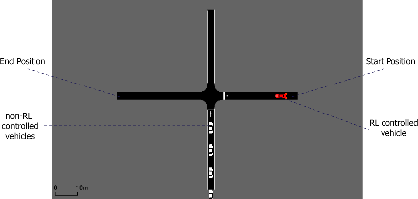
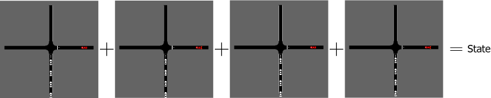
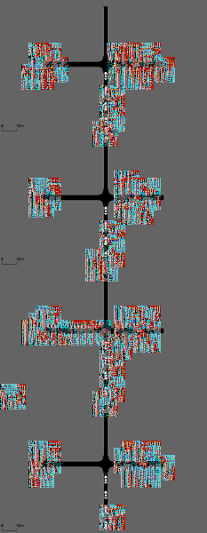

# TrafficBayesianDDQN

## Introduction ##
### Objectives ###
This project aims to implement a reinforcement learning algorithm to control vehicles on a driving simulator and, given the success of this control, to attack the images used as input to our decision-making algorithm, detect this attacks and defend the system from them. 

We use a Double Deep Q-Network algorithm to accomplish the goal of crossing a junction explained on section **Goals**.

### Organization ###
Here the reader can find two versions of the algorithm: 
* **PER_DDQN**, with a Convolutional Neural Network. This version does not implement attacks to the Neural Network, just perform the training for the DDQN algorithm.

* **PER_DDQN**, with a Bayesian Convolutional Neural Network. This version has the implementation of the attacks and its detection. Further work is to defend the algorithm from the attacks.

## Getting Started ##
### Prerequisites ###
To run the simulations we use SUMO - Simulation of Urban Mobility as our simulator together with a modified version of flow framework to machine learning in SUMO. The version of flow used is no longer available in their page, it will soon be available in this GitHub for download.

**Simulator**
* SUMO 1.0.1

**Framework**
* Flow

**Artificial Intelligence**
* Pytorch 0.4.1

**A FULL LIST OF THE DEPENDENCIES WILL BE AVAILABLE SOON**

## Development ##
### The problem ##
For the first version of this project, we decided to use aerial images of the simulation rather than 3D road simulations because of the image complexity. This approach allowed the use of 2D simulation as specified in the figure below.

### Definitions ###
DDQN have its essence in a Markov Decision Process, and its parameters are specified below.
**Set of states**
Each state is defined as a concatenation of four screenshots of the aerial view of the simulation.
**Set of actions**
To a simple first version, we define our set of actions with just two actions: 
			{accelerate, deccelerate}
**Rewards**
The only thing that matters for the agent is to cross the junction without being involved in a collision. In this way, in each state the rewards are the following:
* +50, if reaches the end of the lane
* -100, if collide
* -0.001, for each step on the simulation

### Convergence ###
Because of DDQN have no proof of convergence, it's not so easy to reach good results when we implement it. The following techniques help us to achieve better results.

**Frame Concatenation**
To give to the Neural Network sense of movement, including positioning, velocity and acceleration of the vehicles, we define each state as four consecutive frames concatenated

**Prioritized Experience Replay - PER**
Usually, DDQN uses n last transitions (a tuple with the state, the action, the next state achieved and the reward obtained) to train the Model (the Neural Network) in each step of the simulation. The problem with that is that we might focus on good or bad transition, depending on how is going the simulation. To minimize this problem, we use a Prioritized Experience Replay, where the most important transitions are stored on the memory instead of the last ones.

### Attacks ###
**Fast Gradient Sign Method - FGSM**
We are not concerned about which method of attack is being used, the focus is to be able to defend the agent from any type of attack. Particularly, we are using a method called FGSM, where we use the gradient of the loss function of the neural network to attack the image. An example of the attack is the image below.

### Detection ###
Our model is a Bayesian Neural Network built with dropout, which means that we are able to retrieve the uncertainty of the output from the model. To detect if the agent is being attacked, we check if this uncertainty is beyond a determined threshold.

### Dealing with the attacks ###
In progress

## References ##
**Markov Decision Process (MDP) and Q-learning**
The reader can find great material on these topics in chapters 17 and 21 of 
RUSSELL, S. J.; NORVIG, P. Artificial intelligence: a modern approach. [S.l.]: Malaysia; Pearson Education Limited„ 2016

**Deep Q-Networks (DQN)**
* Mnih, V., Kavukcuoglu, K., Silver, D., Graves, A., Antonoglou, I., Wierstra, D., & Riedmiller, M. (2013). Playing atari with deep reinforcement learning. arXiv preprint arXiv:1312.5602.

* Mnih, V., Kavukcuoglu, K., Silver, D., Rusu, A. A., Veness, J., Bellemare, M. G., ... & Petersen, S. (2015). Human-level control through deep reinforcement learning. Nature, 518(7540), 529.

**Double Deep Q-Networks (DDQN)**
* Van Hasselt, H., Guez, A., & Silver, D. (2016, February). Deep Reinforcement Learning with Double Q-Learning. In AAAI (Vol. 2, p. 5).

**Prioritized Experience Replay (PER)**
* Schaul, T., Quan, J., Antonoglou, I., & Silver, D. (2015). Prioritized experience replay. arXiv preprint arXiv:1511.05952.
* [Implementation](https://github.com/rlcode/per "Implementation")

**Attacks**
* Huang, S., Papernot, N., Goodfellow, I., Duan, Y., & Abbeel, P. (2017). Adversarial attacks on neural network policies. arXiv preprint arXiv:1702.02284.

**Detection**
* Gal, Y., & Ghahramani, Z. (2016, June). Dropout as a Bayesian approximation: Representing model uncertainty in deep learning. In international conference on machine learning (pp. 1050-1059).
* T. Pinder, Adversarial Detection Through Bayesian Approximations In Deep Learning, MSC Data Science Thesis, Lancaster University, 2018

